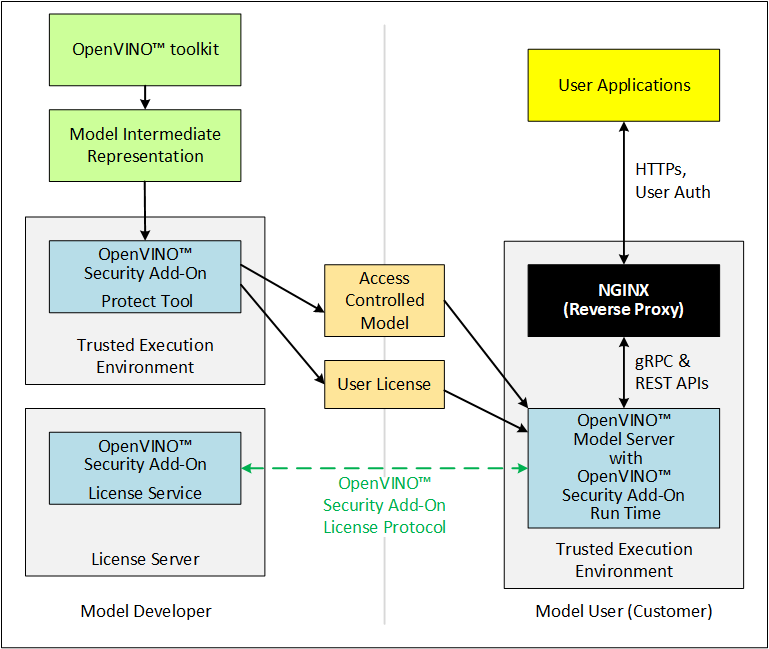

## Overview

The OpenVINO™ Security Add-on (OVSA) works with the [OpenVINO™ Model Server (OVMS)](https://github.com/openvinotoolkit/model_server) on Intel® architecture. Together, the OVSA and OVMS help you control the access to your OpenVINO™ models through secure packaging and secure model execution. Your users install a component on their systems to allow them to use the models within the limits that you assign.

** Where the OpenVINO™ Security Add-on Fits into Model Development and Deployment **

To get started on OpenVINO™ Security Add-on like building and executing an example, please refer to [Getting started guide](docs/ovsa_get_started.md)
