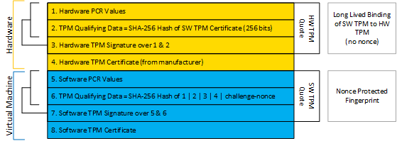

# OpenVINO Toolkit Security Add-on Fingerprint Changes for Release 2021.3

The format of the Platform Quote used in the Runtime Reference Fingerprint has changed in release 2021.3 of the OpenVINO Security Add-on. The Guest Quote (virtual machine) and Host Quote (physical machine) are now bound to each other as shown in the diagram below.

- Lines 1 - 4 relate in the diagram to information from the physical machine (obtained from the TPM on host machine)
- Lines 5 - 8 relate to information from the virtual machine (obtained from swtpm). 

Since the hardware quote contains a hash of the software TPM certificate, the verifier can verify that the software quote was generated from the physical machine running the OpenVINO Toolkit Security Add-on virtual machine. This binding is strengthened if the entirety of the software stack that launches the guest virtual machine is trusted and has not been tampered with – this property should be ensured by the customer deployment to help the ISV better trust this assertion.