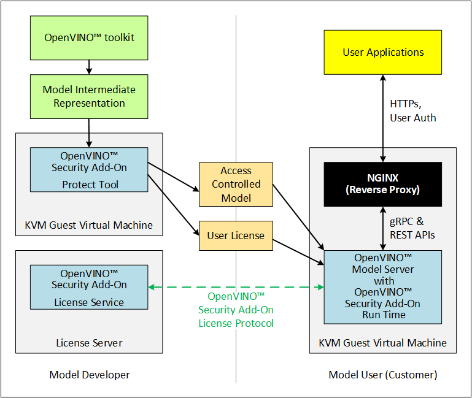

# OpenVINO™ Security Add-on for Host

This guide provides instructions to run the OpenVINO™ Security Add-on in a Host Machine.

**Where the OpenVINO™ Security Add-on fits into Model Development and Deployment**



## About the Installation
In this guide, one person would act as Model Developer, Independent Software Vendor, and User on the same Host Machine.
| Machine      | Purpose |
| ----------- | ----------- |
|  Host Machine    |    The Model Developer uses the Host Machine to enable access control to the completed model. <br>The Independent Software Provider hosts the License Service.<br>The User would contact the License Service and run the access controlled model.   |

## Prerequisites <a name="prerequisites"></a>

**Hardware**
* Intel® Core™ or Xeon® processor<br>

**Operating system, firmware, and software**
* Ubuntu 20.04.3 LTS on the Host Machine.<br>
* TPM version 2.0-conformant Discrete Trusted Platform Module (dTPM) or Firmware Trusted Platform Module (fTPM)
* Secure Boot is enabled in BIOS<br>

**Other**
* The Independent Software Vendor must have access to a Certificate Authority (CA) that implements the Online Certificate Status Protocol (OCSP), supporting Elliptic Curve Cryptography (ECC) certificates for deployment.
* The example in this document uses self-signed certificates.

## How to Prepare a Host Machine <a name="setup-host"></a>

This section is for the combined role of Model Developer/Independent Software Vendor and the Model User.

Begin this step on the host machine that meets the <a href="#prerequisites">prerequisites</a>.

1. Download the [OpenVINO™ Security Add-on](https://github.com/openvinotoolkit/security_addon)
	```sh
	git clone https://github.com/openvinotoolkit/security_addon.git ~/security_addon
	cd ~/security_addon
	```
2. Install the TPM dependency packages on the host machine. Run the script `install_tpm_deps.sh` to install all the required packages.
	```sh
	cd ~/security_addon/Scripts/reference
	sudo -E ./install_tpm_deps.sh
	```
3. Setup the Full Disk Encryption, refer to  [Full Disk Encryption on Ubuntu 20.04 using LUKS with TPM](ovsa_fde_setup.md) 

4. Install Docker
    ```sh	
    sudo -E apt-get install -y apt-transport-https ca-certificates curl gnupg-agent software-properties-common
    curl -fsSL https://download.docker.com/linux/ubuntu/gpg | sudo apt-key add -
    sudo add-apt-repository \
           "deb [arch=amd64] https://download.docker.com/linux/ubuntu \
           $(lsb_release -cs) \
           stable"
    sudo -E apt-get update
    sudo -E apt-get remove docker docker-engine docker.io containerd runc
    sudo -E apt-get install -y docker-ce docker-ce-cli containerd.io             
    ```	

## How to Build and Install the OpenVINO™ Security Add-on Software <a name="ovsa-install"></a>

Follow the below steps to build and install OpenVINO™ Security Add-on.

### Step 1: Build the OpenVINO™ Model Server 
Building OpenVINO™ Security Add-on depends on OpenVINO™ Model Server docker containers. Download and build OpenVINO™ Model Server first on the host.

1. Download and build the [OpenVINO™ Model Server software](https://github.com/openvinotoolkit/model_server)
   ```sh
   git clone https://github.com/openvinotoolkit/model_server.git ~/model_server
   cd ~/model_server
   git checkout v2022.1
   sudo -E make docker_build
   ```
	
### Step 2: Build the OpenVINO™ Security Add-on for all roles

1. Go to the OpenVINO™ Security Add-on source directory downloaded earlier.
	```sh
	cd ~/security_addon
	```

2. Build the OpenVINO™ Security Add-on:
	```sh
	make clean all
	make package
	```

3. Go to the `release_files_host` directory:
	The following packages are created under the `release_files_host` directory:
	- `ovsa-tools.tar.gz`: OVSA Tools for the model developer and the model user 
	- `ovsa-model-hosting.tar.gz`: OVSA Runtime for the model user
	- `ovsa-license-server.tar.gz`: License Server

4. Create `ovsa` user
	```sh
	sudo useradd -m ovsa
	sudo passwd ovsa
	```

### Step 3: Install packages on the host from release_files_host

1. Go to the `release_files_host` directory:
	```sh
	cd release_files_host
	export OVSA_RELEASE_PATH=$PWD
	```
2.  Install the OpenVINO™ Security Add-on Tools for the Model Developer & Model Users
	```sh
    cd $OVSA_RELEASE_PATH
	tar xvfz ovsa-tools.tar.gz
	cd ovsa-tools
	sudo ./install.sh
	```
	This would install the OpenVINO™ Security Add-on Software to `/opt/ovsa/host` folder. The below are the folder structure details:
	- `/opt/ovsa/host/bin`- Contains all the binaries
	- `/opt/ovsa/host/lib` - Contains all the dependent libraries
	- `/opt/ovsa/host/scripts` - Contains scripts to setup path
	- `/opt/ovsa/host/keystore` - This is the folder where all keystore files would be created and accessed
	- `/opt/ovsa/host/artefacts` - This is the folder where all artefacts files would be created and accessed

3. Install the License Server :
	> **Note**: In case the License Server need to be hosted on a different machine by the ISV, ensure to the run the ```Scripts\reference\install_tpm_deps.sh``` from [OpenVINO™ Security Add-on](https://github.com/openvinotoolkit/security_addon) repo to install the TPM runtime dependencies **(there is no dependency on the physical TPM hardware)**. 
	```sh
	cd $OVSA_RELEASE_PATH
	tar xvfz ovsa-license-server.tar.gz
	cd ovsa-license-server
	sudo -E ./install.sh
	```
	This would install the OpenVINO™ Security Add-on License Server to `/opt/ovsa/` folder. The below are the folder structure details:
	- `/opt/ovsa/bin`- Contains all the binaries
	- `/opt/ovsa/lib`- Contains all the dependent libraries
	- `/opt/ovsa/DB`- Contains the database & scripts to create and update the database
	- `/opt/ovsa/scripts`- Contains scripts to setup path and generate certificates
	- `/opt/ovsa/certs`- This is the folder where the License Server certificate are allowed to be present.

4. Start the license server on a separate terminal as `ovsa` user.
	```sh
	source /opt/ovsa/scripts/setupvars.sh
	cd /opt/ovsa/bin
	./license_server
	```
	> **Note**: If you are behind a firewall, check and set your proxy settings to ensure the license server is able to validate the certificates.
	
5. Install  Model Hosting Component
	```sh
	cd $OVSA_RELEASE_PATH
	tar xvfz ovsa-model-hosting.tar.gz
	cd ovsa-model-hosting
	sudo ./install.sh
	```
	This would install the OpenVINO™ Security Add-on Software to `/opt/ovsa/host` folder. The below are the folder structure details:
	- `/opt/ovsa/host/example_client` - Contains scripts to perform the inference
	- `/opt/ovsa/host/example_runtime` - Contains scripts and sample Json file to start the OpenVINO™ Model Server

## How to Use the OpenVINO™ Security Add-on

This section requires interactions between the Model Developer/Independent Software vendor and the User. All roles must complete all applicable <a href="#setup-host">set up steps</a> before beginning this section.

This document uses the face-detection-retail-0004 model as an example. 

The following figure describes the interactions between the Model Developer, Independent Software Vendor, and User.


### Model Developer - Publish Model

The Model Developer creates model, defines access control and creates the user license. After the model is created, access control enabled, and the license is ready, the Model Developer provides the license details to the Independent Software Vendor before sharing to the Model User.

Log on to the Host Machine in a new terminal.

#### Step 1: Setup up the artefacts directory
To enable the corresponding artefacts are available to the OpenVINO™ Model Server, the below artefacts would need to be created under `/opt/ovsa/host/artefacts/fd/` directory.
```sh
mkdir -p /opt/ovsa/host/artefacts/fd/1
source /opt/ovsa/host/scripts/setupvars.sh
```
#### Step 2: Create a key store and add a certificate to it
1. Create files to request a certificate:
	This example uses a self-signed certificate for demonstration purposes. In a production environment, use CSR files to request for a CA-signed certificate. 
	```sh
	/opt/ovsa/host/bin/ovsatool keygen -storekey -t ECDSA -n Intel -k /opt/ovsa/host/keystore/isv_keystore -r  /opt/ovsa/host/artefacts/fd/1/isv_keystore.csr -e "/C=IN/CN=localhost"
 	```
	Below four files are created along with the keystore file:
	- `primary_isv_keystore.csr`- A Certificate Signing Request (CSR)  
	- `primary_isv_keystore.csr.crt` - A self-signed certificate
	- `secondary_isv_keystore.csr`- A Certificate Signing Request (CSR)  
	- `secondary_isv_keystore.csr.crt` - A self-signed certificate

	In a production environment, obtain CA-signed certificates using the `primary_isv_keystore.csr` and `secondary_isv_keystore.csr`.
		
	The above certificates must be inserted to the Trust Store using instructions specified in the [Inserting Trusted Certificate into the Trust Store](trusted_certificates.md)  document

3. Add the certificate to the key store
	```sh
	/opt/ovsa/host/bin/ovsatool keygen -storecert -c /opt/ovsa/host/artefacts/fd/1/primary_isv_keystore.csr.crt -k  /opt/ovsa/host/keystore/isv_keystore
	/opt/ovsa/host/bin/ovsatool keygen -storecert -c /opt/ovsa/host/artefacts/fd/1/secondary_isv_keystore.csr.crt -k  /opt/ovsa/host/keystore/isv_keystore
	```

#### Step 3: Download the model

This example uses `curl` to download the `face-detection-retail-004` model from the OpenVINO Model Zoo. If you are behind a firewall, check and set your proxy settings.

Download a model from the Model Zoo:
```sh
curl --create-dirs https://download.01.org/opencv/2021/openvinotoolkit/2021.1/open_model_zoo/models_bin/1/face-detection-retail-0004/FP32/face-detection-retail-0004.xml https://download.01.org/opencv/2021/openvinotoolkit/2021.1/open_model_zoo/models_bin/1/face-detection-retail-0004/FP32/face-detection-retail-0004.bin -o /opt/ovsa/host/artefacts/face-detection-retail-0004.xml -o /opt/ovsa/host/artefacts/face-detection-retail-0004.bin
```
The model is downloaded to the `/opt/ovsa/host/artefacts/` directory

#### Step 4: Define access control for  the model and create a master license for it

Define and enable the model access control and master license:
```sh	
uuid=$(uuidgen)
/opt/ovsa/host/bin/ovsatool controlAccess -i /opt/ovsa/host/artefacts/face-detection-retail-0004.xml /opt/ovsa/host/artefacts/face-detection-retail-0004.bin -n "face detection" -d "face detection retail" -v 0004 -p /opt/ovsa/host/artefacts/fd/1/face_detection_model.dat -m /opt/ovsa/host/artefacts/fd/1/face_detection_model.masterlic -k /opt/ovsa/host/keystore/isv_keystore -g $uuid
```
The Intermediate Representation files for the `face-detection-retail-0004` model are encrypted as `face_detection_model.dat` and a master license is generated as `face_detection_model.masterlic`

#### Step 5: Create a Runtime Reference TCB

Use the runtime reference TCB to create a customer license for the access controlled model and the specific runtime.

Generate the reference TCB for the runtime
```sh
/opt/ovsa/host/bin/ovsaruntime gen-tcb-signature -n "Face Detect @ Runtime VM Host" -v "1.0" -f /opt/ovsa/host/artefacts/fd/1/face_detect_runtime_vm.tcb -k /opt/ovsa/host/keystore/isv_keystore  -h 0xffffff
```
> **Note**:  If any of the PCR register needs to be excluded from validation with license server, it can be excluded while generating the reference TCB using "-s" & "-h" option. If any PCR registers from HW TPM needs to be excluded the corresponding bit needs to be cleared with "-h" option. Ex, if PCR0 needs to be excluded use -h 0xFFFFFE. Use "tpm2_pcrread" command to read the PCR register values from TPM.

#### Step 6: Publish the access controlled Model and Runtime Reference TCB
The access controlled model is ready to be shared with the User and the reference TCB is ready to perform license checks.

### Model User - Request Access Controlled Model
Continue to generate the Model User artefacts in the same terminal used to generate the Model Developer artefacts

#### Step 1: Create a key store and add a certificate to it
1. Generate a Customer key store file:
	```sh
	/opt/ovsa/host/bin/ovsatool keygen -storekey -t ECDSA -n Intel -k /opt/ovsa/host/keystore/custkeystore -r  /opt/ovsa/host/artefacts/fd/1/custkeystore.csr -e "/C=IN/CN=localhost"
	```
	Below four files are created along with the keystore file:
	* `primary_custkeystore.csr` - A Certificate Signing Request (CSR)
	* `primary_custkeystore.csr.crt` - A self-signed certificate
	* `secondary_custkeystore.csr` - A Certificate Signing Request (CSR)
	* `secondary_custkeystore.csr.crt` - A self-signed certificate
		
2. Obtain CA-signed certificate using `primary_custkeystore.csr` and `secondary_custkeystore.csr`.
		
   The above certificates must be inserted to the Trust Store using instructions specified in the [Inserting Trusted Certificate into the Trust Store](trusted_certificates.md)  document

3. Add the certificate to the key store:
	```sh
	/opt/ovsa/host/bin/ovsatool keygen -storecert -c /opt/ovsa/host/artefacts/fd/1/primary_custkeystore.csr.crt -k /opt/ovsa/host/keystore/custkeystore
	/opt/ovsa/host/bin/ovsatool keygen -storecert -c /opt/ovsa/host/artefacts/fd/1/secondary_custkeystore.csr.crt -k /opt/ovsa/host/keystore/custkeystore
	```
#### Step 2: Request an access controlled Model from the Model Developer

1. Communicate your need for a model to the Model Developer. The Developer will ask you to provide the certificate from your key store and other information. This example uses the length of time the model needs to be available. 
2. The model User's primary and secondary certificates needs to be provided to the Developer.

Since in this example uses the same host machine enviroment, the data would be available between Model Developer and the Model User.

### Model Developer - Generate Customer License

#### Step 1: Receive a User Request
1. Obtain artefacts from the User who needs access to a access controlled model:
	* Customer primary certificate from the customer's key store to be used for generating the customer license.
	* Customer secondary certificate from the customer's key store for validating the customer by the License Server.
	* Other information that apply to your licensing practices, such as the length of time the user needs access to the model

   The above customer certificates must be inserted to the Trust Store using instructions specified in the [Inserting Trusted Certificate into the Trust Store](trusted_certificates.md)  document

#### Step 2: Create Customer License Configuration
Create a customer license configuration
```sh
/opt/ovsa/host/bin/ovsatool licgen -t TimeLimit -l30 -n "Time Limit License Config" -v 1.0 -u "localhost:4452" /opt/ovsa/certs/server.crt -k /opt/ovsa/host/keystore/isv_keystore -o /opt/ovsa/host/artefacts/fd/1/30daylicense.config
```

> **Note**:<br>- Ensure you provide the correct ip-address and port where the License Server is running.<br>- The parameter /opt/ovsa/certs/server.crt  contains the certificate used by the License Server. The server certificate will be added to the customer license and validated during use. Refer to [OpenVINO™ Security Add-on License Server Certificate Pinning](ovsa_license_server_cert_pinning.md)

#### Step 3: Create the customer license
```sh
/opt/ovsa/host/bin/ovsatool sale -m /opt/ovsa/host/artefacts/fd/1/face_detection_model.masterlic -k /opt/ovsa/host/keystore/isv_keystore -l /opt/ovsa/host/artefacts/fd/1/30daylicense.config -t /opt/ovsa/host/artefacts/fd/1/face_detect_runtime_vm.tcb -p /opt/ovsa/host/artefacts/fd/1/primary_custkeystore.csr.crt -c /opt/ovsa/host/artefacts/fd/1/face_detection_model.lic
```
> **Note**: If new private keys are generated, a new customer license would need to be generated for the model.

#### Step 4: Update the license server database with the license.
> **Note**: If the License Server is hosted on a different machine, the customer license, customer primary and secondary certificates need to be copied to the machine hosting the License Server first and then updated to the DB.
```sh
python3 /opt/ovsa/DB/ovsa_store_customer_lic_cert_db.py /opt/ovsa/DB/ovsa.db /opt/ovsa/host/artefacts/fd/1/face_detection_model.lic /opt/ovsa/host/artefacts/fd/1/primary_custkeystore.csr.crt /opt/ovsa/host/artefacts/fd/1/secondary_custkeystore.csr.crt
```

#### Step 5: Share the AccessControlled Model with Model User
Provide these files to the User:
	* `face_detection_model.dat`
	* `face_detection_model.lic`

Since all these files are availble in the artefacts are available to model User

### Model User - Load Access Contolled Model to OpenVINO™ Model Server

#### Step 1: Load the access controlled model into the OpenVINO™ Model Server
1. Receive the access controlled model and the customer license file from the Model Developer

2.  Prepare to load the model:
	```sh
	cd /opt/ovsa/host/example_runtime
	```

3. Edit the `sample.json` to include the names of the access controlled model artefacts you received from the Model Developer. The file looks like this:
	```sh
	{
	"custom_loader_config_list":[
		{
			"config":{
					"loader_name":"ovsa",
					"library_path": "/ovsa-runtime/lib/libovsaruntime.so"
			}
		}
	],
	"model_config_list":[
		{
		"config":{
			"name":"controlled-access-model",
			"base_path":"/opt/ovsa/host/artefacts/fd",
			"custom_loader_options": {"loader_name":  "ovsa", "keystore":  "/opt/ovsa/host/keystore/custkeystore", "controlled_access_file": "face_detection_model"}
		}
		}
	]
	}
	```
#### Step 2: Start the NGINX Model Server
The NGINX Model Server publishes the access controlled model.
```sh
./start_secure_ovsa_host_model_server.sh
```
For information about the NGINX interface, see https://github.com/openvinotoolkit/model_server/blob/main/extras/nginx-mtls-auth/README.md

#### Step 3: Prepare to run Inference

1. Log on to the Host Machine from another terminal.

2. Navigate to the example_client folder in `/opt/ovsa/host/example_client`
	```sh
	cd /opt/ovsa/host/example_client/
	```

3. Install the Python dependencies for your set up. For example:
	```sh
	# before install
	pip3 install --upgrade pip
	sudo apt-get install python3-venv
	# first time install
	python3 -m venv .env 
	source .env/bin/activate
	python -m pip install --upgrade pip
	pip install futures==3.1.1
	pip install opencv-python==4.4.0.46
	pip install tensorflow-serving-api==2.*
	deactivate
	```

4. Download the sample images for inferencing. An image directory is created that includes a sample image for inferencing.
	```sh
	curl --create-dirs https://raw.githubusercontent.com/openvinotoolkit/model_server/master/example_client/images/people/people1.jpeg -o images/people1.jpeg
	```

#### Step 4:  Run Inference

Run the `face_detection.py` script.
```sh
cd /opt/ovsa/host/example_client/
source .env/bin/activate
python face_detection.py --grpc_port 3335 --batch_size 1 --width 300 --height 300 --input_images_dir images --output_dir results --tls --server_cert /var/OVSA/Modelserver/server.pem --client_cert /var/OVSA/Modelserver/client.pem --client_key /var/OVSA/Modelserver/client.key --model_name controlled-access-model
```

## Summary
You have completed these tasks:
- Set up one or more computers (Host Machines) as Host Machines
- Installed the OpenVINO™ Security Add-on 
- Used the OpenVINO™ Model Server to work with OpenVINO™ Security Add-on.
- As a Model Developer or Independent Software Vendor, you access controlled a model and prepared a license for it using the OpenVINO™ Security Add-on for Host.
- As a Model Developer or Independent Software Vendor, you prepared and ran a License Server and used the License Server to verify a User had a valid license to use a access controlled model.
- As a User, you provided information to a Model Developer or Independent Software Vendor to get a access controlled model and the license for the model.
- As a User, you set up and launched a Host Server on which you can run licensed and access controlled models.
- As a User, you loaded a access controlled model, validated the license for the model, and used the model to run inference.

## References
Use these links for more information:
- [OpenVINO&trade; toolkit](https://software.intel.com/en-us/openvino-toolkit)
- [OpenVINO Model Server Quick Start Guide](https://github.com/openvinotoolkit/model_server/blob/main/docs/ovms_quickstart.md)
- [Model repository](https://github.com/openvinotoolkit/model_server/blob/main/docs/models_repository.md)
