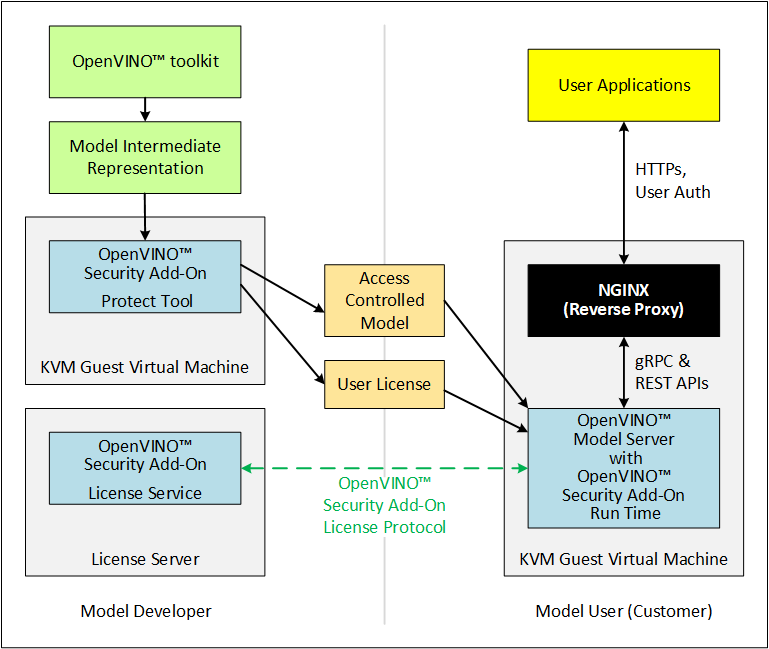

# OpenVINO™ Security Add-on for KVM

This guide provides instructions to run the OpenVINO™ Security Add-on in a Kernel-based Virtual Machines (KVMs).

**Where the OpenVINO™ Security Add-on for KVM fits into Model Development and Deployment**



The binding between SWTPM (vTPM used in guest VM) and HW TPM (TPM on the host) is explained in [this document](fingerprint-changes.md)

## About the Installation
The Model Developer, Independent Software Vendor, and User each must prepare one physical hardware machine and one Kernel-based Virtual Machine (KVM). In addition, each person must prepare a Guest Virtual Machine (Guest VM) for each role that person plays.

For example:
* If one person acts as both the Model Developer and as the Independent Software Vendor, that person must prepare two Guest VMs. Both Guest VMs can be on the same physical hardware (Host Machine) and under the same KVM on that Host Machine.
* If one person acts as all three roles, that person must prepare three Guest VMs. All three Guest VMs can be on the same Host Machine and under the same KVM on that Host Machine.

**Purpose of Each Machine**

| Machine      | Purpose |
| ----------- | ----------- |
| Host Machine      | Physical hardware on which the KVM and Guest VM share set up.      |
| Kernel-based Virtual Machine (KVM)    | The OpenVINO™ Security Add-on runs in this virtual machine because it provides an isolated environment for security sensitive operations.        |
|  Guest VM    |    The Model Developer uses the Guest VM to enable access control to the completed model. <br>The Independent Software Provider uses the Guest VM to host the License Service.<br>The User uses the Guest VM to contact the License Service and run the access controlled model.   |


## Prerequisites <a name="prerequisites"></a>

**Hardware**
* Intel® Core™ or Xeon® processor<br>

**Operating system, firmware, and software**
* Ubuntu 20.04.3 LTS on the Host Machine.<br>
* TPM version 2.0-conformant Discrete Trusted Platform Module (dTPM) or Firmware Trusted Platform Module (fTPM)
* Virtualization support is enabled in BIOS
* Secure Boot is enabled in BIOS<br>

**Other**
* The Independent Software Vendor must have access to a Certificate Authority (CA) that implements the Online Certificate Status Protocol (OCSP), supporting Elliptic Curve Cryptography (ECC) certificates for deployment.
* The example in this document uses self-signed certificates.

## How to Prepare a Host Machine <a name="setup-host"></a>

This section is for the combined role of Model Developer and Independent Software Vendor, and the separate User role.

### Step 1: Clone the OpenVINO™ Security Add-on repository

Begin this step on the Intel® Core™ or Xeon® processor machine that meets the <a href="#prerequisites">prerequisites</a>.

Download the [OpenVINO™ Security Add-on](https://github.com/openvinotoolkit/security_addon)
```sh
git clone https://github.com/openvinotoolkit/security_addon.git ~/security_addon
cd ~/security_addon
```

### Step 2: Set up Packages on the Host Machine<a name="setup-packages"></a>

Run the script `setup_prerequisites_kvm.sh`. The script would check for your hardware configuration and install all the required prerequisite packages. 

To run the script ensure you have the following:
 - Login as the `root` user or user with `sudo` permission.
 - Internet connectivity with required proxy settings.

```sh
sudo -E ./setup_prerequisites_kvm.sh
```

Alternately, you can setup the host machine manually. Refer the [Installing the Host machine dependency packages for KVM](ovsa_install_host_dependencies_kvm.md) document to setup the host machine manually.

If you are running behind a proxy, [set up a proxy for Docker](https://docs.docker.com/config/daemon/systemd/).

Ensure the current user is added to the docker group
   ```
   sudo usermod -aG docker $USER
   ```

Create a temporary workspace directory to store all the scripts and other files required as part of setup
```sh
# To store all the scripts
sudo mkdir -p /var/OVSA/scripts

# To store OS image required for creating a VM
sudo mkdir -p /var/OVSA/iso

# To store the VM disk image files
sudo mkdir -p /var/OVSA/vm_images

# To store the vTPM files
sudo mkdir -p /var/OVSA/vtpm

# Copy required reference scripts
sudo cp ~/security_addon/Scripts/reference/* /var/OVSA/scripts
sudo cp ~/security_addon/Scripts/host/OVSA_write_hwquote_swtpm_nvram.py /var/OVSA/scripts
```

### Step 3: Set up Networking on the Host Machine<a name="setup-networking"></a>

This step is for the combined Model Developer and Independent Software Vendor roles. If Model User VM is running on different physical host, repeat the following steps for that host also.

In this step you verify the availability of the virtual bridge virbr0 and create the necessary up/down scripts for virbr0. The virtual bridge is automatically created in the previous step while setting up the packages on the host machine.

1. Verify the virtual bridge:
   ```sh
   ip a | grep virbr0
   ```
   The output should looks similar to this and shows the availabiltiy of 192.168.122.1 IP addresses:
   ```sh
   4: virbr0: <BROADCAST,MULTICAST,UP,LOWER_UP> mtu 1500 qdisc noqueue state UP group default qlen 1000 inet 192.168.122.1/24 brd 192.168.122.255 scope global virbr0
   ```

2. Use the `virbr0-qemu-ifup` and `virbr0-qemu-ifdown` copied to the `/var/OVSA/scripts` directory to bring up the `virbr0` interface while launching the Guest VMs.

Alternately, you can also setup the networking in such a way to assign a global IP address for your VMs, so they can be accessed accross the network. Refer the [Configure global IP address for the VMs](ovsa_configure_global_ip_kvm.md) document to setup the network with the global IP address.

### Step 4: Set Up one Guest VM for the combined roles of Model Developer and Independent Software Vendor<a name="dev-isv-vm"></a>

For each separate role you play, you must prepare a virtual machine, called a Guest VM. Because in this release, the Model Developer and Independent Software Vendor roles are combined, these instructions guide you to set up one Guest VM, named `ovsa_isv_dev`.

Begin these steps on the Host Machine. 

As an option, you can use `virsh` and the virtual machine manager to create and bring up a Guest VM. See the `libvirtd` documentation for instructions if you'd like to do this.

1. Download the [Ubuntu 20.04 server ISO image](https://releases.ubuntu.com/focal/ubuntu-20.04.4-live-server-amd64.iso)
   ```sh
   sudo rm /var/OVSA/iso/ubuntu-20.04.4-live-server-amd64.iso
   sudo -E wget https://releases.ubuntu.com/focal/ubuntu-20.04.4-live-server-amd64.iso -P /var/OVSA/iso
   ```

2. Create an empty virtual disk image to serve as the Guest VM for your role as Model Developer and Independent Software Vendor:
   ```sh
   sudo qemu-img create -f qcow2 /var/OVSA/vm_images/ovsa_isv_dev_vm_disk.qcow2 20G
   ```

3. Install Ubuntu 20.04 on the Guest VM. Name the Guest VM `ovsa_isv_dev`:
   ```sh
   sudo qemu-system-x86_64 -m 4096 -enable-kvm \
   -cpu host \
   -drive if=virtio,file=/var/OVSA/vm_images/ovsa_isv_dev_vm_disk.qcow2,cache=none \
   -cdrom /var/OVSA/iso/ubuntu-20.04.4-live-server-amd64.iso \
   -device e1000,netdev=hostnet1,mac=52:54:00:d1:66:5f \
   -netdev tap,id=hostnet1,script=/var/OVSA/scripts/virbr0-qemu-ifup,downscript=/var/OVSA/scripts/virbr0-qemu-ifdown \
   -vnc :1
   ```

4. Connect a VNC client with `<host-ip-address>:1`

5. Follow the prompts on the screen to finish installing the Guest VM. Name the VM as `ovsa_isv_dev`

6. Shut down the Guest VM. 

7. Restart the Guest VM after removing the option of cdrom image:
   ```sh
   sudo qemu-system-x86_64 -m 4096 -enable-kvm \
   -cpu host \
   -drive if=virtio,file=/var/OVSA/vm_images/ovsa_isv_dev_vm_disk.qcow2,cache=none \
   -device e1000,netdev=hostnet1,mac=52:54:00:d1:66:5f \
   -netdev tap,id=hostnet1,script=/var/OVSA/scripts/virbr0-qemu-ifup,downscript=/var/OVSA/scripts/virbr0-qemu-ifdown \
   -vnc :1
   ```

8. Choose ONE of these options to install additional required software:

   Copy the script `install_guest_deps.sh` from the Scripts/reference directory of the OVSA repository to the Guest VM<br>

   Run the `install_guest_deps.sh` script as `root` user or `sudo` user.<br>

   Shut down the Guest VM.<br>

   **Note:** Alternately, you can install the additional package on the Guest VM manually. Refer the [Installing the Guest VM dependency packages for KVM](ovsa_install_guest_dependencies_kvm.md) document to setup the Guest VM manually.


9. On the host, create a directory to support the virtual TPM device and provision its certificates. Only `root` should have read/write permission to this directory:
   ```sh
   sudo mkdir -p /var/OVSA/vtpm/vtpm_isv_dev
   export XDG_CONFIG_HOME=~/.config
   /usr/share/swtpm/swtpm-create-user-config-files
   sudo swtpm_setup --tpmstate /var/OVSA/vtpm/vtpm_isv_dev --create-ek-cert --create-platform-cert --overwrite --tpm2 --pcr-banks -
   ```

   **Note**: For steps 10 and 11, you can copy and edit the script named `start_ovsa_isv_dev_vm.sh` in the `Scripts/reference` directory in the OpenVINO™ Security Add-on repository instead of manually running the commands. If using the script, select the script with `isv` in the file name regardless of whether you are playing the role of the Model Developer or the role of the Independent Software Vendor. Edit the script to point to the correct directory locations and increment `vnc` for each Guest VM.

10. Start the vTPM on Host, write the HW TPM data into its NVRAM and restart the vTPM for QEMU:
    ```sh
    sudo swtpm socket --tpm2 --server port=8280 \
                     --ctrl type=tcp,port=8281 \
                     --flags not-need-init --tpmstate dir=/var/OVSA/vtpm/vtpm_isv_dev &

    sudo tpm2_startup --clear -T swtpm:port=8280
    sudo tpm2_startup -T swtpm:port=8280
    sudo python3 /var/OVSA/scripts/OVSA_write_hwquote_swtpm_nvram.py 8280
    sudo pkill -f vtpm_isv_dev

    sudo swtpm socket --tpmstate dir=/var/OVSA/vtpm/vtpm_isv_dev \
	 --tpm2 \
         --ctrl type=unixio,path=/var/OVSA/vtpm/vtpm_isv_dev/swtpm-sock \
         --log level=20 &
    ```

11. Start the Guest VM:
    ```sh
    sudo qemu-system-x86_64 \
     -cpu host \
     -enable-kvm \
     -m 4096 \
     -smp 8,sockets=1,cores=8,threads=1 \
     -drive if=virtio,file=/var/OVSA/vm_images/ovsa_isv_dev_vm_disk.qcow2,cache=none \
     -device e1000,netdev=hostnet1,mac=52:54:00:d1:66:5f \
     -netdev tap,id=hostnet1,script=/var/OVSA/scripts/virbr0-qemu-ifup,downscript=/var/OVSA/scripts/virbr0-qemu-ifdown \
     -chardev socket,id=chrtpm,path=/var/OVSA/vtpm/vtpm_isv_dev/swtpm-sock \
     -tpmdev emulator,id=tpm0,chardev=chrtpm \
     -device tpm-tis,tpmdev=tpm0 \
     -vnc :1
    ```
    Use the QEMU runtime options in the command to change the memory amount or CPU assigned to this Guest VM.
   
12. Use a VNC client to log on to the Guest VM at `<host-ip-address>:1`


### Step 5: Set Up one Guest VM for the User role

1. Choose ONE of these options to create a Guest VM for the User role:

	<details><summary>Option 1: Copy and Rename the `ovsa_isv_dev_vm_disk.qcow2` disk image</summary>
	
	1. Copy the `ovsa_isv_dev_vm_disk.qcow2` disk image to a new image named `ovsa_runtime_vm_disk.qcow2`.

	2. Boot the new image.
	```sh
	sudo qemu-system-x86_64 -m 4096 -enable-kvm \
           -cpu host \
          -drive if=virtio,file=/var/OVSA/vm_images/ovsa_runtime_vm_disk.qcow2,cache=none \
          -device e1000,netdev=hostnet1,mac=52:54:00:d1:66:5f \
          -netdev tap,id=hostnet1,script=/var/OVSA/scripts/virbr0-qemu-ifup,downscript=/var/OVSA/scripts/virbr0-qemu-ifdown \
          -vnc :2
	```
	Use a VNC client to log on to the Guest VM at `<host-ip-address>:2`

	3. Change the hostname from `ovsa_isv_dev` to `ovsa_runtime`.  
		```sh 
		sudo hostnamectl set-hostname ovsa_runtime
		```
	
	4. Replace all instances of 'ovsa_isv_dev' to 'ovsa_runtime' in the new image.
		```sh 	
		sudo nano /etc/hosts
		```
	5. Change the `/etc/machine-id`:
		```sh
		sudo rm /etc/machine-id
		sudo systemd-machine-id-setup
		```
	6. Shut down the Guest VM.<br><br>

	Click the triangled line above to close Option 1.
	</details>

	<details><summary>Option 2: Manually create the Guest VM</summary>
	
	1. Create an empty virtual disk image:
		```sh
		sudo qemu-img create -f qcow2 /var/OVSA/vm_images/ovsa_runtime_vm_disk.qcow2 20G
		```

	2. Install Ubuntu 20.04 on the Guest VM. Name the Guest VM `ovsa_runtime`:
		```sh
		sudo qemu-system-x86_64 -m 4096 -enable-kvm \
		-cpu host \
		-drive if=virtio,file=/var/OVSA/vm_images/ovsa_runtime_vm_disk.qcow2,cache=none \
		-cdrom /var/OVSA/iso/ubuntu-20.04.4-live-server-amd64.iso \
		-device e1000,netdev=hostnet1,mac=52:54:00:d1:66:5f \
		-netdev tap,id=hostnet1,script=/var/OVSA/scripts/virbr0-qemu-ifup,downscript=/var/OVSA/scripts/virbr0-qemu-ifdown \
		-vnc :2
		```
	
	3. Connect a VNC client with `<host-ip-address>:2`.
	
	4. Follow the prompts on the screen to finish installing the Guest VM. Name the Guest VM `ovsa_runtime`.
	
	5. Shut down the Guest VM. 
	
	6. Restart the Guest VM:
		```sh
		sudo qemu-system-x86_64 -m 4096 -enable-kvm \
		-cpu host \
		-drive if=virtio,file=/var/OVSA/vm_images/ovsa_runtime_vm_disk.qcow2,cache=none \
		-device e1000,netdev=hostnet1,mac=52:54:00:d1:66:5f \
		-netdev tap,id=hostnet1,script=/var/OVSA/scripts/virbr0-qemu-ifup,downscript=/var/OVSA/scripts/virbr0-qemu-ifdown \
		-vnc :2
		```
	
	7. Choose ONE of these options to install additional required software:

	   Copy the script `install_guest_deps.sh` from the Scripts/reference directory of the OVSA repository to the Guest VM<br>
	   
	   Run the `install_guest_deps.sh` script as `root` user or `sudo` user.<br>
	   
	   Shut down the Guest VM.<br>

	   **Note:** Alternately, you can install the additional package on the Guest VM manually. Refer the [Installing the Guest VM dependency packages for KVM](ovsa_install_guest_dependencies_kvm.md) document to setup the Guest VM manually.
	</details>

2. Create a directory to support the virtual TPM device and provision its certificates. Only `root` should have read/write permission to this directory:
   ```sh
   sudo mkdir /var/OVSA/vtpm/vtpm_runtime
   
   export XDG_CONFIG_HOME=~/.config
   /usr/share/swtpm/swtpm-create-user-config-files
   sudo swtpm_setup --tpmstate /var/OVSA/vtpm/vtpm_runtime --create-ek-cert --create-platform-cert --overwrite --tpm2 --pcr-banks -
   ```
   **Note**: For steps 3 and 4, you can copy and edit the script named `start_ovsa_runtime_vm.sh` in the 'Scripts/reference' directory in the OpenVINO™ Security Add-on repository instead of manually running the commands. Edit the script to point to the correct directory locations and increment `vnc` for each Guest VM. This means that if you are creating a third Guest VM on the same Host Machine, change `-vnc :2` to `-vnc :3`


3. Start the vTPM, write the HW TPM data into its NVRAM and restart the vTPM for QEMU:
	```sh     
    sudo swtpm socket --tpm2 --server port=8380 \
                      --ctrl type=tcp,port=8381 \
                      --flags not-need-init --tpmstate dir=/var/OVSA/vtpm/vtpm_runtime &

    sudo tpm2_startup --clear -T swtpm:port=8380
    sudo tpm2_startup -T swtpm:port=8380
    sudo python3 /var/OVSA/scripts/OVSA_write_hwquote_swtpm_nvram.py 8380    
    sudo pkill -f vtpm_runtime
	
	sudo swtpm socket --tpmstate dir=/var/OVSA/vtpm/vtpm_runtime \
	--tpm2 \
	--ctrl type=unixio,path=/var/OVSA/vtpm/vtpm_runtime/swtpm-sock \
	--log level=20 &
	```
4. Start the Guest VM in a new terminal:
	```sh
	sudo qemu-system-x86_64 \
	 -cpu host \
	 -enable-kvm \
	 -m 4096 \
	 -smp 8,sockets=1,cores=8,threads=1 \
	 -drive if=virtio,file=/var/OVSA/vm_images/ovsa_runtime_vm_disk.qcow2,cache=none \
	 -device e1000,netdev=hostnet3,mac=52:54:00:d1:67:5f \
	 -netdev tap,id=hostnet3,script=/var/OVSA/scripts/virbr0-qemu-ifup,downscript=/var/OVSA/scripts/virbr0-qemu-ifdown \
	 -chardev socket,id=chrtpm,path=/var/OVSA/vtpm/vtpm_runtime/swtpm-sock \
	 -tpmdev emulator,id=tpm0,chardev=chrtpm \
	 -device tpm-tis,tpmdev=tpm0 \
	 -vnc :2
	```

   Use the QEMU runtime options in the command to change the memory amount or CPU assigned to this Guest VM.
   
5. Use a VNC client to log on to the Guest VM at `<host-ip-address>:2`

 </details>  

## How to Build and Install the OpenVINO™ Security Add-on Software <a name="ovsa-install"></a>

Follow the below steps to build and install OpenVINO™ Security Add-on.

### Step 1: Build the OpenVINO™ Model Server 
Building OpenVINO™ Security Add-on depends on OpenVINO™ Model Server docker containers. Download and build OpenVINO™ Model Server first on the host.

1. Download and build the [OpenVINO™ Model Server software](https://github.com/openvinotoolkit/model_server)
   ```sh
   git clone https://github.com/openvinotoolkit/model_server.git ~/model_server
   cd ~/model_server
   git checkout v2022.1
   sudo -E make docker_build
   ```
	
### Step 2: Build the OpenVINO™ Security Add-on for all roles

This step is for the combined role of Model Developer and Independent Software Vendor, and the User

1. Go to the OpenVINO™ Security Add-on source directory cloned earlier.
   ```sh
   cd ~/security_addon
   ```

2. Build the OpenVINO™ Security Add-on:
   ```sh
   make clean all
   sudo -E make package
   ```
	The following packages are created under the `release_files` directory:
	- `ovsa-developer.tar.gz`: For the Model Developer and the Independent Software Developer
	- `ovsa-model-hosting.tar.gz`: For the User
	- `ovsa-license-server.tar.gz`: License Server

### Step 3: Copy the Model Developer/ISV and Model Hosting packages to the respective VMs

1. Go to the `release_files` directory:
	```sh
	cd release_files
	export OVSA_RELEASE_PATH=$PWD
	```
2. Copy the Model Developer/ISV and License Server packages to the ISV-Developer VM:
	```sh
	cd $OVSA_RELEASE_PATH
	scp ovsa-developer.tar.gz username@<isv-developer-vm-ip-address>:/<username-home-directory>/
	scp ovsa-license-server.tar.gz username@<isv-developer-vm-ip-address>:/<username-home-directory>/
     ```
3. Copy the Model Hosting package to the User VM:
	```sh
	cd $OVSA_RELEASE_PATH
	scp ovsa-model-hosting.tar.gz username@<runtime-vm-ip-address>:/<username-home-directory>/
	```

### Step 4: Install the OpenVINO™ Security Add-on Model Developer / ISV Components
This step is for the combined role of Model Developer and Independent Software Vendor. References to the Guest VM are to `ovsa_isv_dev`.

1. Log on to the Model Developer / ISV Guest VM  as `<user>`.
2.	Create `ovsa` user
	```sh
	sudo useradd -m ovsa
	sudo passwd ovsa
	```
3. Install the OpenVINO™ Security Add-on software to the Guest VM:
	```sh
	cd ~/
	tar xvfz ovsa-developer.tar.gz
	cd ovsa-developer
	sudo ./install.sh
	```
	This would install the OpenVINO™ Security Add-on Software to `/opt/ovsa/kvm` folder. The below are the folder structure details:
	- `/opt/ovsa/kvm/bin`- Contains all the binaries
	- `/opt/ovsa/kvm/lib` - Contains all the dependent libraries
	- `/opt/ovsa/kvm/scripts` - Contains scripts to setup path
	- `/opt/ovsa/kvm/keystore` - This is the folder where all keystore files would be created and accessed
	- `/opt/ovsa/kvm/artefacts` - This is the folder where all artefacts files would be created and accessed

4. Install the License Server to the Guest VM:
	```sh
	cd ~/
	tar xvfz ovsa-license-server.tar.gz
	cd ovsa-license-server
	sudo ./install.sh
	```
	This would install the OpenVINO™ Security Add-on License Server to `/opt/ovsa/` folder. The below are the folder structure details:
	- `/opt/ovsa/bin`- Contains all the binaries
	- `/opt/ovsa/lib`- Contains all the dependent libraries
	- `/opt/ovsa/DB`- Contains the database & scripts to create and update the database
	- `/opt/ovsa/scripts`- Contains scripts to setup path and generate certificates
	- `/opt/ovsa/certs`- This is the folder where the License Server certificate are allowed to be present.

5. Start the license server on a separate terminal as `ovsa` user.
	```sh
	source /opt/ovsa/scripts/setupvars.sh
	cd /opt/ovsa/bin
	./license_server
	```
	**NOTE**: If you are behind a firewall, check and set your proxy settings to ensure the license server is able to validate the certificates.

### Step 5: Install the OpenVINO™ Security Add-on Model Hosting Component
This step is for the User. References to the Guest VM are to `ovsa_runtime`.

The Model Hosting components install the OpenVINO™ Security Add-on Runtime Docker container based on OpenVINO™ Model Server NGINX Docker to host a access controlled model.

1. Log on to the User Guest VM as `<user>`.

2.	Create `ovsa` user
	```sh
	sudo useradd -m ovsa
	sudo passwd ovsa
	sudo usermod -aG docker ovsa
	```

3. Install the software to the Guest VM:
	```sh
	cd ~/
	tar xvfz ovsa-model-hosting.tar.gz
	cd ovsa-model-hosting
	sudo ./install.sh
	```
	This would install the OpenVINO™ Security Add-on Software to `/opt/ovsa/kvm` folder. The below are the folder structure details:
	- `/opt/ovsa/kvm/bin`- Contains all the binaries
	- `/opt/ovsa/kvm/lib` - Contains all the dependent libraries
	- `/opt/ovsa/kvm/scripts` - Contains scripts to setup path
	- `/opt/ovsa/kvm/example_client` - Contains scripts to perform the inference
	- `/opt/ovsa/kvm/example_runtime` - Contains scripts and sample Json file to start the OpenVINO™ Model Server
	- `/opt/ovsa/kvm/keystore` - This is the folder where all keystore files would be created and accessed
	- `/opt/ovsa/kvm/artefacts` - This is the folder where all artefacts files would be created and accessed

## How to Use the OpenVINO™ Security Add-on

This section requires interactions between the Model Developer/Independent Software vendor and the User. All roles must complete all applicable <a href="#setup-host">set up steps</a> and <a href="#ovsa-install">installation steps</a> before beginning this section.

This document uses the face-detection-retail-0004 model as an example. 

The following figure describes the interactions between the Model Developer, Independent Software Vendor, and User.

**Remember**: The Model Developer/Independent Software Vendor and User roles are related to virtual machine use and one person might fill the tasks required by multiple roles. In this document the tasks of Model Developer and Independent Software Vendor are combined and use the Guest VM named `ovsa_isv`. It is possible to have all roles set up on the same Host Machine.


### Model Developer Instructions

The Model Developer creates model, defines access control and creates the user license. After the model is created, access control enabled, and the license is ready, the Model Developer provides the license details to the Independent Software Vendor before sharing to the Model User.

References to the Guest VM are to `ovsa_isv_dev`. Log on to the Guest VM as `ovsa` user.

#### Step 1: Setup up the artefacts directory
The corresponding Face Detection artefacts to be created under `/opt/ovsa/kvm/artefacts/fd/` directory.
```sh
mkdir -p /opt/ovsa/kvm/artefacts/fd
source /opt/ovsa/kvm/scripts/setupvars.sh
```
#### Step 2: Create a key store and add a certificate to it
1. Create files to request a certificate:
	This example uses a self-signed certificate for demonstration purposes. In a production environment, use CSR files to request for a CA-signed certificate.
 
	```sh
	/opt/ovsa/kvm/bin/ovsatool keygen -storekey -t ECDSA -n Intel -k /opt/ovsa/kvm/keystore/isv_keystore -r  /opt/ovsa/kvm/artefacts/isv_keystore.csr -e "/C=IN/CN=localhost"
 	```
	Below four files are created along with the keystore file:
	- `primary_isv_keystore.csr`- A Certificate Signing Request (CSR)  
	- `primary_isv_keystore.csr.crt` - A self-signed certificate
	- `secondary_isv_keystore.csr`- A Certificate Signing Request (CSR)  
	- `secondary_isv_keystore.csr.crt` - A self-signed certificate

	In a production environment, obtain CA-signed certificates using the `primary_isv_keystore.csr` and `secondary_isv_keystore.csr`.
		
	The above certificates must be inserted to the Trust Store using instructions specified in the [Inserting Trusted Certificate into the Trust Store](trusted_certificates.md)  document

3. Add the certificate to the key store
	```sh
	/opt/ovsa/kvm/bin/ovsatool keygen -storecert -c /opt/ovsa/kvm/artefacts/primary_isv_keystore.csr.crt -k  /opt/ovsa/kvm/keystore/isv_keystore
	/opt/ovsa/kvm/bin/ovsatool keygen -storecert -c /opt/ovsa/kvm/artefacts/secondary_isv_keystore.csr.crt -k  /opt/ovsa/kvm/keystore/isv_keystore
	```

#### Step 3: Download the model

This example uses `curl` to download the `face-detection-retail-004` model from the OpenVINO Model Zoo. If you are behind a firewall, check and set your proxy settings.

Download a model from the Model Zoo:
```sh
curl --create-dirs https://download.01.org/opencv/2021/openvinotoolkit/2021.1/open_model_zoo/models_bin/1/face-detection-retail-0004/FP32/face-detection-retail-0004.xml https://download.01.org/opencv/2021/openvinotoolkit/2021.1/open_model_zoo/models_bin/1/face-detection-retail-0004/FP32/face-detection-retail-0004.bin -o /opt/ovsa/kvm/artefacts/face-detection-retail-0004.xml -o /opt/ovsa/kvm/artefacts/face-detection-retail-0004.bin
```
The model is downloaded to the `/opt/ovsa/kvm/artefacts/` directory

#### Step 4: Define access control for  the model and create a master license for it

Define and enable the model access control and master license:
```sh	
uuid=$(uuidgen)
/opt/ovsa/kvm/bin/ovsatool controlAccess -i /opt/ovsa/kvm/artefacts/face-detection-retail-0004.xml /opt/ovsa/kvm/artefacts/face-detection-retail-0004.bin -n "face detection" -d "face detection retail" -v 0004 -p /opt/ovsa/kvm/artefacts/fd/face_detection_model.dat -m /opt/ovsa/kvm/artefacts/fd/face_detection_model.masterlic -k /opt/ovsa/kvm/keystore/isv_keystore -g $uuid
```
The Intermediate Representation files for the `face-detection-retail-0004` model are encrypted as `face_detection_model.dat` and a master license is generated as `face_detection_model.masterlic`

#### Step 5: Create a Runtime Reference TCB

Use the runtime reference TCB to create a customer license for the access controlled model and the specific runtime.

Generate the reference TCB for the runtime
```sh
/opt/ovsa/kvm/bin/ovsaruntime gen-tcb-signature -n "Face Detect @ Runtime VM" -v "1.0" -f /opt/ovsa/kvm/artefacts/fd/face_detect_runtime_vm.tcb -k /opt/ovsa/kvm/keystore/isv_keystore -s 0xffffff -h 0xffffff
```

#### Step 6: Publish the access controlled Model and Runtime Reference TCB
The access controlled model is ready to be shared with the User and the reference TCB is ready to perform license checks.

#### Step 7: Receive a User Request
1. Obtain artefacts from the User who needs access to a access controlled model:
	* Customer primary & secondary certificate from the customer's key store.
	* Other information that apply to your licensing practices, such as the length of time the user needs access to the model.
	* Refer to **Model User Instructions** Step 1 and 2 to generate the customer's keystore and share the primary & secondary certificate.
		
	The above customer certificates must be inserted to the Trust Store using instructions specified in the [Inserting Trusted Certificate into the Trust Store](trusted_certificates.md)  document

2. Create a customer license configuration
	```sh
	/opt/ovsa/kvm/bin/ovsatool licgen -t TimeLimit -l30 -n "Time Limit License Config" -v 1.0 -u "<isv-developer-vm-ip-address>:<license_server-port>" /opt/ovsa/certs/server.crt  -k /opt/ovsa/kvm/keystore/isv_keystore -o /opt/ovsa/kvm/artefacts/fd/30daylicense.config
	```
	
	**NOTE**: 
	- Ensure you provide the correct ip-address and port where the License Server is running.
	- The parameter /opt/ovsa/certs/server.crt  contains the certificate used by the License Server. The server certificate will be added to the customer license and validated during use. Refer to [OpenVINO™ Security Add-on License Server Certificate Pinning](ovsa_license_server_cert_pinning.md)

3. Create the customer license
	```sh
	/opt/ovsa/kvm/bin/ovsatool sale -m /opt/ovsa/kvm/artefacts/fd/face_detection_model.masterlic -k /opt/ovsa/kvm/keystore/isv_keystore -l /opt/ovsa/kvm/artefacts/fd/30daylicense.config -t /opt/ovsa/kvm/artefacts/fd/face_detect_runtime_vm.tcb -p /opt/ovsa/kvm/artefacts/fd/primary_custkeystore.csr.crt -c /opt/ovsa/kvm/artefacts/fd/face_detection_model.lic
	```

4. Update the license server database with the license.
	```sh
	python3 /opt/ovsa/DB/ovsa_store_customer_lic_cert_db.py /opt/ovsa/DB/ovsa.db /opt/ovsa/kvm/artefacts/fd/face_detection_model.lic /opt/ovsa/kvm/artefacts/fd/primary_custkeystore.csr.crt /opt/ovsa/kvm/artefacts/fd/secondary_custkeystore.csr.crt
	```

5. Provide these files to the User:
	* `face_detection_model.dat`
	* `face_detection_model.lic`

### Model User Instructions
References to the Guest VM are to `ovsa_rumtime`. Log on to the Guest VM as `ovsa` user.

#### Step 1: Setup up the artefacts directory
To enable the corresponding artefacts are available to the OpenVINO™ Model Server, the below artefacts would need to be stored under `/opt/ovsa/kvm/artefacts/fd/1/`
```sh
mkdir -p /opt/ovsa/kvm/artefacts/fd/1/
source /opt/ovsa/kvm/scripts/setupvars.sh
```

#### Step 2: Add a Certificate to a Key Store
1. Generate a Customer key store file:
	```sh
	/opt/ovsa/kvm/bin/ovsatool keygen -storekey -t ECDSA -n Intel -k /opt/ovsa/kvm/keystore/custkeystore -r  /opt/ovsa/kvm/artefacts/custkeystore.csr -e "/C=IN/CN=localhost"
	```
	Below four files are created along with the keystore file:
	* `primary_custkeystore.csr` - A Certificate Signing Request (CSR)
	* `primary_custkeystore.csr.crt` - A self-signed certificate
	* `secondary_custkeystore.csr` - A Certificate Signing Request (CSR)
	* `secondary_custkeystore.csr.crt` - A self-signed certificate
		
2. Obtain CA-signed certificate using `primary_custkeystore.csr` and `secondary_custkeystore.csr`.
		
   The above certificates must be inserted to the Trust Store using instructions specified in the [Inserting Trusted Certificate into the Trust Store](trusted_certificates.md)  document

3. Add the certificate to the key store:
	```sh
	/opt/ovsa/kvm/bin/ovsatool keygen -storecert -c /opt/ovsa/kvm/artefacts/primary_custkeystore.csr.crt -k /opt/ovsa/kvm/keystore/custkeystore
	/opt/ovsa/kvm/bin/ovsatool keygen -storecert -c /opt/ovsa/kvm/artefacts/secondary_custkeystore.csr.crt -k /opt/ovsa/kvm/keystore/custkeystore
	```

#### Step 3: Request an access controlled Model from the Model Developer
This example uses scp to share data between the ovsa_runtime and ovsa_dev Guest VMs on the same Host Machine.

1. Communicate your need for a model to the Model Developer. The Developer will ask you to provide the certificate from your key store and other information. This example uses the length of time the model needs to be available. 
2. The model user's certificate needs to be provided to the Developer:
	```sh
	scp /opt/ovsa/kvm/artefacts/primary_custkeystore.csr.crt username@<developer-vm-ip-address>:/opt/ovsa/kvm/artefacts/fd
	scp /opt/ovsa/kvm/artefacts/secondary_custkeystore.csr.crt username@<developer-vm-ip-address>:/opt/ovsa/kvm/artefacts/fd
	```

#### Step 4: Receive and load the access controlled model into the OpenVINO™ Model Server
1. Receive the model as files named below and copy them to `/opt/ovsa/kvm/artefacts/fd/1` directory
	* face_detection_model.dat
	* face_detection_model.lic
		```sh
		cd /opt/ovsa/kvm/artefacts/fd/1
		scp username@<developer-vm-ip-address>:/opt/ovsa/kvm/artefacts/fd/face_detection_model.dat .
		scp username@<developer-vm-ip-address>:/opt/ovsa/kvm/artefacts/fd/face_detection_model.lic .
		```

2. Prepare to load the model:
	```sh
	cd /opt/ovsa/kvm/example_runtime
	```

4. Edit the `sample.json` to include the names of the access controlled model artefacts you received from the Model Developer. The file looks like this:
	```sh
	{
	"custom_loader_config_list":[
		{
			"config":{
					"loader_name":"ovsa",
					"library_path": "/ovsa-runtime/lib/libovsaruntime.so"
			}
		}
	],
	"model_config_list":[
		{
		"config":{
			"name":"controlled-access-model",
			"base_path":"/opt/ovsa/kvm/artefacts/fd",
			"custom_loader_options": {"loader_name":  "ovsa", "keystore":  "/opt/ovsa/kvm/keystore/custkeystore", "controlled_access_file": "face_detection_model"}
		}
		}
	]
	}
	```
#### Step 5: Start the NGINX Model Server
The NGINX Model Server publishes the access controlled model.
```sh
./start_secure_ovsa_model_server.sh
```
For information about the NGINX interface, see https://github.com/openvinotoolkit/model_server/blob/main/extras/nginx-mtls-auth/README.md

#### Step 6: Prepare to run Inference

1. Log on to the Guest VM from another terminal.

2. Install the Python dependencies for your set up. For example:
	```sh
	sudo apt install pip3
	pip3 install cmake
	pip3 install scikit-build
	pip3 install opencv-python==4.4.0.46
	pip3 install futures==3.1.1
	pip3 install tensorflow-serving-api==1.14.0
	```
3. Navigate to the example_client directory in `/opt/ovsa/kvm/example_client`
	```sh
	cd /opt/ovsa/kvm/example_client/
	```
4. Download the sample images for inferencing. An image directory is created that includes a sample image for inferencing.
	```sh
	curl --create-dirs https://raw.githubusercontent.com/openvinotoolkit/model_server/master/example_client/images/people/people1.jpeg -o images/people1.jpeg
	```

#### Step 7: Run Inference

Run the `face_detection.py` script.
```sh
python3 face_detection.py --grpc_port 3335 --batch_size 1 --width 300 --height 300 --input_images_dir images --output_dir results --tls --server_cert /var/OVSA/Modelserver/server.pem --client_cert /var/OVSA/Modelserver/client.pem --client_key /var/OVSA/Modelserver/client.key --model_name controlled-access-model
```

## Summary
You have completed these tasks:
- Set up one or more computers (Host Machines) with one KVM per machine and one or more virtual machines (Guest VMs) on the Host Machines
- Installed the OpenVINO™ Security Add-on 
- Used the OpenVINO™ Model Server to work with OpenVINO™ Security Add-on.
- As a Model Developer or Independent Software Vendor, you access controlled a model and prepared a license for it using the OpenVINO™ Security Add-on for KVM.
- As a Model Developer or Independent Software Vendor, you prepared and ran a License Server and used the License Server to verify a User had a valid license to use a access controlled model.
- As a User, you provided information to a Model Developer or Independent Software Vendor to get a access controlled model and the license for the model.
- As a User, you set up and launched a Host Server on which you can run licensed and access controlled models.
- As a User, you loaded a access controlled model, validated the license for the model, and used the model to run inference.

## References
Use these links for more information:
- [OpenVINO&trade; toolkit](https://software.intel.com/en-us/openvino-toolkit)
- [OpenVINO Model Server Quick Start Guide](https://github.com/openvinotoolkit/model_server/blob/main/docs/ovms_quickstart.md)
- [Model repository](https://github.com/openvinotoolkit/model_server/blob/main/docs/models_repository.md)
