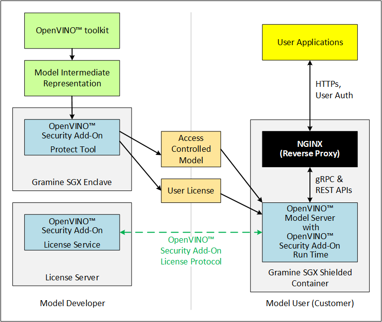
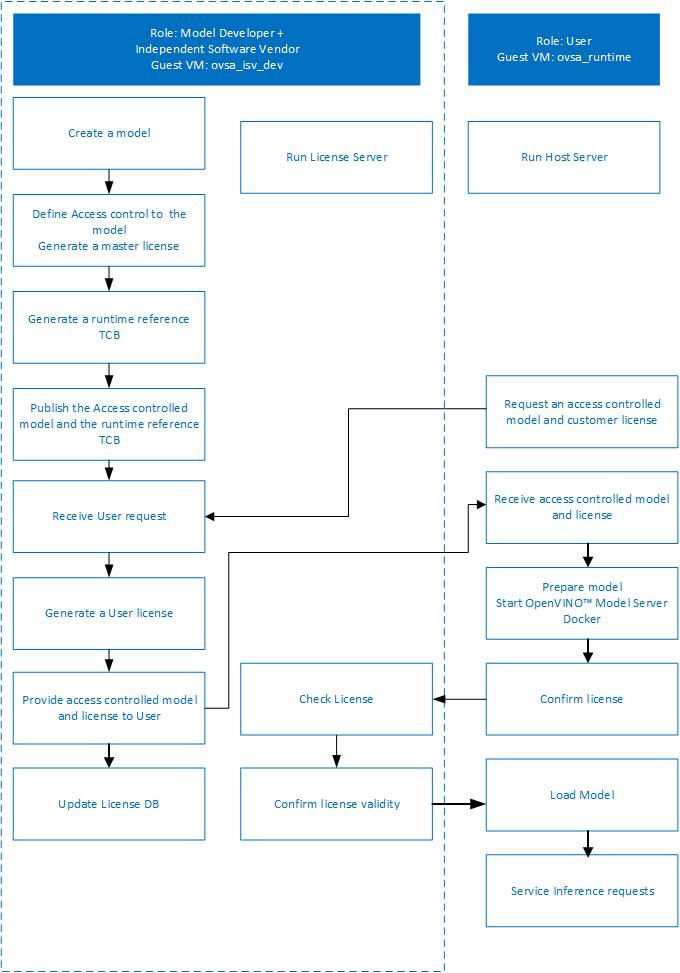

 # OpenVINO™ Security Add-on for Gramine-SGX

This guide provides instructions to run the OpenVINO™ Security Add-on in an Intel® Software Guard Extensions(Intel® SGX) enabled CPU running inside a Gramine-SGX Enclave.

**Where the OpenVINO™ Security Add-on for Gramine-SGX fits into Model Development and Deployment**




## About the Installation
In this guide, one person would act as Model Developer, Independent Software Vendor, and User on the same Host Machine.


| Machine      | Purpose |
| ----------- | ----------- |
|  Host Machine    |    The Model Developer uses the Host Machine to enable access control to the completed model. <br>The Independent Software Provider hosts the License Service.<br>The User would contact the License Service and run the access controlled model.   |


## Prerequisites <a name="prerequisites"></a>

**Hardware**
* Intel® 3rd Generation Scalable Xeon Processor (Ice Lake processor) with SGX support

**Operating system, firmware, and software**
* Ubuntu* Linux* 20.04 with a minimum of 5.11 kernel with built-in SGX driver


**Other**
* The Independent Software Vendor must have access to a Certificate Authority (CA) that implements the Online Certificate Status Protocol (OCSP), supporting Elliptic Curve Cryptography (ECC) certificates for deployment.
* The example in this document uses self-signed certificates.

## How to Prepare a Host Machine <a name="setup-host"></a>

This section is for the combined role of Model Developer/Independent Software Vendor and the Model User.

Begin this step on the Intel® 3rd Generation Scalable Xeon Processor machine that meets the <a href="#prerequisites">prerequisites</a>.

1. Install the Intel® SGX Data Center Attestation Primitives (DCAP) for Linux, which provides software
modules to aid Intel® Applications in performing attestation

	Refer to the <a href="https://download.01.org/intel-sgx/sgx-dcap/1.12/linux/docs/Intel_SGX_SW_Installation_Guide_for_Linux.pdf">Intel® SGX SW Installation Guide</a> for SGX installation

2. Verify SGX DCAP installation

	Run the DCAP Quote Generation/Verification samples to ensure the DCAP installation is successful.

3. Install Docker
    ```sh	
    sudo apt-get remove docker docker-engine docker.io containerd runc
    sudo apt-get install -y apt-transport-https ca-certificates curl gnupg-agent software-properties-common
        curl -fsSL https://download.docker.com/linux/ubuntu/gpg | sudo apt-key add -

    sudo add-apt-repository \
           "deb [arch=amd64] https://download.docker.com/linux/ubuntu \
              $(lsb_release -cs) \
                 stable"

    sudo apt-get update
    sudo apt-get install -y docker-ce docker-ce-cli containerd.io
    ```	
4. Build and Install Gramine-SGX

	Clone Gramine-SGX **release v1.0**
	```sh
	git clone https://github.com/gramineproject/gramine.git
	cd gramine
	git checkout v1.0
	export GRAMINE_DIR=$PWD
	```
	Prepare a signing key:
	```sh
	openssl genrsa -3 -out Pal/src/host/Linux-SGX/signer/enclave-key.pem 3072
	```
	Build Gramine with SGX and RA-TLS DCAP attestation support:
	```sh
	# this assumes pre-requisites are not available
	sudo apt-get install -y build-essential \
	    autoconf bison gawk libcurl4-openssl-dev libprotobuf-c-dev \
	    ninja-build protobuf-c-compiler python3 python3-click python3-jinja2 \
	    python3-pip python3-protobuf wget
	sudo python3 -m pip install 'meson==0.59.1' 'toml>=0.10'
	# this assumes Linux 5.11+
	meson setup build/ --buildtype=release -Ddirect=enabled -Dsgx=enabled -Ddcap=enabled
	ninja -C build/
	sudo ninja -C build/ install	
	```	
	[For more details refer to Quick start with SGX support](https://gramine.readthedocs.io/en/latest/quickstart.html#quick-start-with-sgx-support)<br>
	**Note** - In the below section you would need to export the GRAMINE_DIR to the path where Gramine was installed
5. Install Gramine-GSC (Gramine Shielded Container) - 
	Clone Gramine-GSC in the Gramine directory
	```sh
	cd $GRAMINE_DIR
	git clone https://github.com/gramineproject/gsc.git
	cd gsc
	git checkout 9fb6b65480387742a90b13b835d37ceacd197dee	
	```
	[Refer to GSC documentation](https://gramine.readthedocs.io/en/latest/gsc.html#gsc-gramine-shielded-containers)
6. Create `ovsa` user
    ```sh    
    sudo useradd -s /bin/bash  -m -d /home/ovsa ovsa
    sudo passwd ovsa
    sudo usermod -aG docker ovsa
    ``` 

You're now ready to build and install the OpenVINO™ Security Add-on on the Host Machine. 


## How to Build and Install the OpenVINO™ Security Add-on Software <a name="install-ovsa"></a>

Follow the below steps to build and Install OpenVINO™ Security Add-on on the host.

### Step 1: Build the OpenVINO™ Model Server image 
Building OpenVINO™ Security Add-on depends on OpenVINO™ Model Server docker containers. Download and build OpenVINO™ Model Server first on the host.

1. Download the [OpenVINO™ Model Server software](https://github.com/openvinotoolkit/model_server)
2. Build the [OpenVINO™ Model Server Docker images](https://github.com/openvinotoolkit/model_server/blob/main/docs/docker_container.md)
	```sh
	git clone https://github.com/openvinotoolkit/model_server.git
    cd model_server
    git checkout v2021.4.1
	make docker_build
	```
### Step 2: Build the software required for all roles

1. Download the [OpenVINO™ Security Add-on](https://github.com/openvinotoolkit/security_addon)

   ```sh
   git clone https://github.com/openvinotoolkit/security_addon
   cd security_addon
   ```
2. Export the Gramine directory path:
	Provide the path to the location where Gramine source was downloaded and built.
   ```sh
   export GRAMINE_DIR=<gramine_source_path>
   ```
3. Build the OpenVINO™ Security Add-on:
   ```sh
   SGX=1 make clean all
   SGX=1 make package
   ```
4. Go to the `release_files` directory:
 	```sh
    cd release_files
 	export OVSA_RELEASE_PATH=$PWD
 	```
	The following packages are created under the `release_files` directory:
	- `ovsa-sgx.tar.gz`: OVSA SGX package
	- `ovsa-license-server.tar.gz`: OVSA License Server package

### Step 3: Install the OpenVINO™ Security Add-on software
This step is for the combined role of Model Developer/Independent Software Vendor and the Model User. 

1. Install the OpenVINO™ Security Add-on Software on the Host Machine: 
    ```sh
    cd $OVSA_RELEASE_PATH
    tar xvfz ovsa-sgx.tar.gz
    cd ovsa-sgx
    sudo ./install.sh
    ```
	This would install the OpenVINO™ Security Add-on Software to `/opt/ovsa/gramine` folder. The below are the folder structure details:
	- `/opt/ovsa/gramine/bin`- Contains all the binaries  
	- `/opt/ovsa/gramine/lib` - Contains all the dependent libraries
	- `/opt/ovsa/gramine/example_client` - Contains scripts to perform the inference
	- `/opt/ovsa/gramine/example_runtime` - Contains scripts and sample Json file to start the OpenVINO™ Model Server
	- `/opt/ovsa/gramine/scripts` - Contains script to setup path
	- `/opt/ovsa/gramine/keystore` - This is the protected folder where all keystore files would be created and accessed
	- `/opt/ovsa/gramine/artefacts` - This is the folder where all artefacts files would be allowed to be created and accessed

### Step 4: Install the OpenVINO™ Security Add-on License Server Components
This step is for the Independent Software Vendor to host the License Server.

1. Install the OpenVINO™ Security Add-on License Server on the Host Machine:
    ```sh
    cd $OVSA_RELEASE_PATH
    tar xvfz ovsa-license-server.tar.gz
    cd ovsa-license-server
    sudo ./install.sh
    ```
	This would install the OpenVINO™ Security Add-on License Server to `/opt/ovsa/` folder. The below are the folder structure details:
	- `/opt/ovsa/bin`- Contains all the binaries
	- `/opt/ovsa/lib`- Contains all the dependent libraries
	- `/opt/ovsa/DB`- Contains the database & scripts to create and update the database
	- `/opt/ovsa/scripts`- Contains scripts to setup path and generate certificates
	- `/opt/ovsa/certs`- This is the folder where the License Server certificate are allowed to be present.

2. Start the OpenVINO™ Security Add-on License Server:

	Log on to the Host Machine in a new terminal.
	```sh
	source /opt/ovsa/scripts/setupvars.sh
	cd /opt/ovsa/bin
	./license_server
	```
	**NOTE:** If you are behind a firewall, check and set your proxy settings to ensure the license server is able to validate the certificates.

## How to Use the OpenVINO™ Security Add-on

This section requires interactions between the Model Developer/Independent Software vendor and the User. All roles must complete all applicable <a href="#setup-host">set up steps</a> and <a href="#ovsa-install">installation steps</a> before beginning this section.

This document uses the face-detection-retail-0004 model as an example.

The following figure describes the interactions between the Model Developer, Independent Software Vendor, and User.



### Understanding the protected, trusted and allowed files/directory
**Protected** - All files/directory specified as protected in the manifest file would be sealed to the platform. The keystore which contains sensitive information would be created in `/opt/ovsa/gramine/keystore` and the keystore would be sealed to the platform based on the `MRSIGNER`. 

**Trusted** - All files/directory specified as trusted in the manifest file would be considered as trusted and measurements would be computed for the same during compile time.

**Allowed** - All files/directory specified as allowed in the manifest file would be loaded into the SGX Enclave. The unprotected models need to be copied to `/opt/ovsa/gramine/artefacts` for loading into the SGX Enclave and access controlling them. All the other artefacts generated by the OpenVINO™ Security Add-on software would also be created in `/opt/ovsa/gramine/artefacts`. 
To ensure the artefact is loaded by OpenVINO™ Model Server, make sure to create a separate model folder `fd` and version folder `1` as required. Eg: `/opt/ovsa/gramine/artefacts/fd/1/`.

Refer <a href="https://gramine.readthedocs.io/en/latest/manifest-syntax.html#allowed-files">here</a> for the Gramine manifest syntax.

### Model Developer - Publish Model
The Model Developer creates model, defines access control and creates the user license. After the model is created, access control enabled, and the license is ready, the Model Developer provides the license details to the Independent Software Vendor before sharing to the Model User.

Log on to the Host Machine in a new terminal.

#### Step 1: Setup the keystore and artefacts directory
1.	To enable the corresponding artefacts are available to the OpenVINO™ Model Server, the below artefacts would need to be created under `/opt/ovsa/gramine/artefacts/fd/1/`

	```sh
	mkdir -p /opt/ovsa/gramine/artefacts/fd/1/
	```

#### Step 2: Create a key store and add a certificate to it
1. Create files to request a certificate:
	This example uses a self-signed certificate for demonstration purposes. In a production environment, use CSR files to request for a CA-signed certificate.
 
	```sh
	cd /opt/ovsa/gramine
	gramine-sgx ovsatool keygen -storekey -t ECDSA -n Intel -k /opt/ovsa/gramine/keystore/isv_keystore -r  /opt/ovsa/gramine/artefacts/fd/1/isv_keystore.csr -e "/C=IN/CN=localhost"
 	```
	Below four files are created along with the keystore file:
	- `primary_isv_keystore.csr`- A Certificate Signing Request (CSR)  
	- `primary_isv_keystore.csr.crt` - A self-signed certificate
	- `secondary_isv_keystore.csr`- A Certificate Signing Request (CSR)  
	- `secondary_isv_keystore.csr.crt` - A self-signed certificate

	In a production environment, send `primary_isv_keystore.csr` to a CA to request a CA-signed certificate.

3. Add the certificate to the key store
	```sh
    gramine-sgx ovsatool keygen -storecert -c  /opt/ovsa/gramine/artefacts/fd/1/primary_isv_keystore.csr.crt -k  /opt/ovsa/gramine/keystore/isv_keystore
    gramine-sgx ovsatool keygen -storecert -c  /opt/ovsa/gramine/artefacts/fd/1/secondary_isv_keystore.csr.crt -k  /opt/ovsa/gramine/keystore/isv_keystore
	```

#### Step 3: Download the model
This example uses `curl` to download the `face-detection-retail-004` model from the OpenVINO Model Zoo. If you are behind a firewall, check and set your proxy settings.

Download a model from the Model Zoo:
```sh
curl --create-dirs https://download.01.org/opencv/2021/openvinotoolkit/2021.1/open_model_zoo/models_bin/1/face-detection-retail-0004/FP32/face-detection-retail-0004.xml https://download.01.org/opencv/2021/openvinotoolkit/2021.1/open_model_zoo/models_bin/1/face-detection-retail-0004/FP32/face-detection-retail-0004.bin -o /opt/ovsa/gramine/artefacts/face-detection-retail-0004.xml -o /opt/ovsa/gramine/artefacts/face-detection-retail-0004.bin
```

The model is downloaded to the `/opt/ovsa/gramine/artefacts/` directory

#### Step 4: Define access control for  the model and create a master license for it

Define and enable the model access control and master license:
```sh
uuid=$(uuidgen)
gramine-sgx  ovsatool controlAccess -i /opt/ovsa/gramine/artefacts/face-detection-retail-0004.xml /opt/ovsa/gramine/artefacts/face-detection-retail-0004.bin -n "face detection" -d "face detection retail" -v 0004 -p /opt/ovsa/gramine/artefacts/fd/1/face_detection_model.dat -m /opt/ovsa/gramine/artefacts/fd/1/face_detection_model.masterlic -k /opt/ovsa/gramine/keystore/isv_keystore -g $uuid
```
The Intermediate Representation files for the `face-detection-retail-0004` model are encrypted as `face_detection_model.dat` and a master license is generated as `face_detection_model.masterlic`

#### Step 5: Create a Runtime Reference TCB

Use the runtime reference TCB to create a customer license for the access controlled model and the specific runtime.

Generate the reference TCB for the runtime
```sh
gramine-sgx ovsaruntime gen-tcb-signature -n "Face Detect @ Runtime" -v "1.0" -f /opt/ovsa/gramine/artefacts/fd/1/face_detect_runtime.tcb -k /opt/ovsa/gramine/keystore/isv_keystore  -s /opt/ovsa/gramine/artefacts/entrypoint.sig
```

#### Step 6: Publish the access controlled Model and Runtime Reference TCB
The access controlled model is ready to be shared with the User and the reference TCB is ready to perform license checks.


### Model User - Request Access Controlled Model
Continue to generate the model User artefacts in the same terminal used to generate the Model Developer artefacts

#### Step 1:  Create a key store and add a certificate to it
1. Generate a Customer key store file:
	```sh
	gramine-sgx ovsatool keygen -storekey -t ECDSA -n Intel -k /opt/ovsa/gramine/keystore/custkeystore -r  /opt/ovsa/gramine/artefacts/fd/1/custkeystore.csr -e "/C=IN/CN=localhost"
	```
	Below four files are created along with the keystore file:
	* `primary_custkeystore.csr` - A Certificate Signing Request (CSR)
	* `primary_custkeystore.csr.crt` - A self-signed certificate
	* `secondary_custkeystore.csr` - A Certificate Signing Request (CSR)
	* `secondary_custkeystore.csr.crt` - A self-signed certificate	

3. Send `primary_custkeystore.csr` and `secondary_custkeystore.csr` to the CA to request a CA-signed certificate.

4. Add the certificate to the key store:
	```sh
	gramine-sgx ovsatool keygen -storecert -c /opt/ovsa/gramine/artefacts/fd/1/primary_custkeystore.csr.crt -k /opt/ovsa/gramine/keystore/custkeystore
	gramine-sgx ovsatool keygen -storecert -c /opt/ovsa/gramine/artefacts/fd/1/secondary_custkeystore.csr.crt -k /opt/ovsa/gramine/keystore/custkeystore
	```

#### Step 2: Request an access controlled Model from the Model Developer

1. Communicate your need for a model to the Model Developer. The Developer will ask you to provide the certificate from your key store and other information. This example uses the length of time the model needs to be available. 
2. The model User's secondary certificate needs to be provided to the Developer.

Since in this example uses the same host machine enviroment, the data would be available between Model Developer and the model User.

### Model Developer - Generate Customer License

#### Step 1: Receive a User Request
1. Obtain artefacts from the User who needs access to a access controlled model:
	* Customer primary certificate from the customer's key store to be used for generating the customer license.
	* Customer secondary certificate from the customer's key store for validating the customer by the License Server.
	* Other information that apply to your licensing practices, such as the length of time the user needs access to the model

#### Step 2: Create Customer License Configuration
 Create a customer license configuration
```sh
gramine-sgx ovsatool licgen -t TimeLimit -l30 -n "Time Limit License Config" -v 1.0 -u "localhost:4451" /opt/ovsa/certs/server.crt  -k /opt/ovsa/gramine/keystore/isv_keystore -o /opt/ovsa/gramine/artefacts/fd/1/30daylicense.config
```
**NOTE**: The parameter /opt/ovsa/certs/server.crt  contains the certificate used by the License Server. The server certificate will be added to the customer license and validated during use. Refer to [OpenVINO™ Security Add-on License Server Certificate Pinning](ovsa_license_server_cert_pinning.md)

#### Step 3: Create the customer license
```sh
gramine-sgx ovsatool sale -m /opt/ovsa/gramine/artefacts/fd/1/face_detection_model.masterlic -k /opt/ovsa/gramine/keystore/isv_keystore -l /opt/ovsa/gramine/artefacts/fd/1/30daylicense.config -t /opt/ovsa/gramine/artefacts/fd/1/face_detect_runtime.tcb -p /opt/ovsa/gramine/artefacts/fd/1/primary_custkeystore.csr.crt -c /opt/ovsa/gramine/artefacts/fd/1/face_detection_model.lic
```
**NOTE**: If new private keys are generated, a new customer license would need to be generated for the model.

#### Step 4: Update the license server database with the license.
```sh
python3 /opt/ovsa/DB/ovsa_store_customer_lic_cert_db.py /opt/ovsa/DB/ovsa.db /opt/ovsa/gramine/artefacts/fd/1/face_detection_model.lic /opt/ovsa/gramine/artefacts/fd/1/secondary_custkeystore.csr.crt
```

#### Step 5: Share the AccessControlled Model with Model User
Provide these files to the User:
	* `face_detection_model.dat`
	* `face_detection_model.lic`

Since all these files are availble in the artefacts are available to model User

### Model User - Load Access Contolled Model to OpenVINO™ Model Server

#### Step 1: Load the access controlled model into the OpenVINO™ Model Server
1. Receive the access controlled model and the customer license file from the Model Developer

2. Prepare to load the model:
The folder `/opt/ovsa/gramine/example_runtime/` contains all the required scripts and configurations to load the model.
	```sh
	cd /opt/ovsa/gramine/example_runtime/
	```

3. Edit `sample.json` to include the names of the access controlled model artefacts you received from the Model Developer. The file looks like this:
	```sh
	{
	"custom_loader_config_list":[
		{
			"config":{
					"loader_name":"ovsa",
					"library_path": "/ovsa-runtime/lib/libovsaruntime.so"
			}
		}
	],
	"model_config_list":[
		{
		"config":{
			"name":"controlled-access-model",
			"base_path":"/opt/ovsa/gramine/artefacts/fd",
			"custom_loader_options": {"loader_name":  "ovsa", "keystore":  "/opt/ovsa/gramine/keystore/custkeystore", "controlled_access_file": "face_detection_model"}
		}
		}
	]
	}
	```
#### Step 2: Start the NGINX Model Server
The NGINX Model Server publishes the access controlled model.
```sh
./start_secure_sgx_ovsa_model_server.sh
```
For information about the NGINX interface, see https://github.com/openvinotoolkit/model_server/blob/main/extras/nginx-mtls-auth/README.md

#### Step 3: Prepare to run Inference

1. Log on to the Host Machine from another terminal.

2. Install the Python dependencies for your set up. For example:
	```sh
	sudo apt install pip3
	pip3 install cmake
	pip3 install scikit-build
	pip3 install opencv-python
	pip3 install futures==3.1.1
	pip3 install tensorflow-serving-api==1.14.0
	```
3. Navigate to the  example_client folder in `/opt/ovsa/example_client`
	```sh
	cd /opt/ovsa/gramine/example_client/
	```
4. Download the sample images for inferencing. An image directory is created that includes a sample image for inferencing.
	```sh
	curl --create-dirs https://raw.githubusercontent.com/openvinotoolkit/model_server/master/example_client/images/people/people1.jpeg -o images/people1.jpeg
	```
#### Step 7: Run Inference

Run the `face_detection.py` script.
```sh
python3 face_detection.py --grpc_port 3335 --batch_size 1 --width 300 --height 300 --input_images_dir images --output_dir results --tls --server_cert /var/OVSA/Modelserver/server.pem --client_cert /var/OVSA/Modelserver/client.pem --client_key /var/OVSA/Modelserver/client.key --model_name controlled-access-model
```

## Summary
You have completed these tasks:
- Set up the Host Machine
- Installed the OpenVINO™ Security Add-on 
- Used the OpenVINO™ Model Server to work with OpenVINO™ Security Add-on
- As a Model Developer or Independent Software Vendor, you access controlled a model and prepared a license for it using OpenVINO™ Security Add-on for Gramine-SGX.
- As a Model Developer or Independent Software Vendor, you prepared and ran a License Server and used the License Server to verify a User had a valid license to use a access controlled model.
- As a User, you provided information to a Model Developer or Independent Software Vendor to get a access controlled model and the license for the model.
- As a User, you loaded a access controlled model, validated the license for the model, and used the model to run inference.


## Known Limitations:

- Reloading of the models due to configuration file change in OVMS depends on checking the file timestamp of the configuration file. In Gramine-SGX checking of file timestamp is not supported. Due to this, the model reload feature would not work. One needs to load all the required models during start-up or need to re-start the OVMS after the configuration file changes.

- Due to static memory allocation for the processes in Gramine-SGX, the number of simultaneous processes/threads can be run is dependent on total SGX memory available. In this example, we have limited NGINX worker threads to 4 in the /etc/nginx/nginx.conf file, GRPC worker threads to 1 and REST worker threads to 3 by passing appropriate command line arguements. This limitation need to be considered if these value needs to be changed.


## References
Use these links for more information:
- [OpenVINO&trade; toolkit](https://software.intel.com/en-us/openvino-toolkit)
- [OpenVINO Model Server Quick Start Guide](https://github.com/openvinotoolkit/model_server/blob/main/docs/ovms_quickstart.md)
- [Model repository](https://github.com/openvinotoolkit/model_server/blob/main/docs/models_repository.md)
- [Intel SGX](https://01.org/intel-softwareguard-extensions)
- [Intel® Software Guard Extensions Data Center Attestation Primitives (Intel® SGX DCAP)](https://github.com/intel/SGXDataCenterAttestationPrimitives) 
- [Gramine SGX](https://gramine.readthedocs.io/en/latest/index.html)
