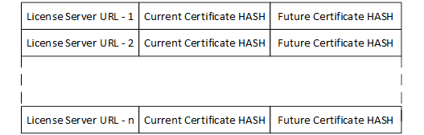

# OpenVINO™ Security Add-on License Server Certificate Pinning
The License Server certificate must be pinned within each Customer License by the Developer.  The certificate pinning ensures that the Customer Runtime establishes TLS connection with the valid and intended License Server and avoids any Man-in-the-Middle attack.

This is done by ensuring that the latest License Server certificate is available to the Developer when a new Customer License is generated. HASH of the current License Server certificate would be added to the generated Customer License.

 

For example, consider current license server certificate is valid for 18months during customer license generation. During the certificate pinning process, HASH of the current license certificate would be added, and HASH of the future certificate would be empty in the Customer License file.  After 12months from current license server certificate date, HASH of future license server certificate would be added, and Customer License would be reissued to Model User.  

At Model User Runtime environment, during TLS handshake with License Server, HASH of the License Server certificate would be validated against the HASH of the License Server Certificate (current / future) stored in the Customer License. 

Once the Customer License is re-issued with HASH of future certificate, ISV has to update this newly generated Customer License file in License Server database. At Model User Runtime environment this would be updated by License Server as part of License check protocol during license validation.

### Provisioning License Server with Certificate
#### Using a Self-Signed Certificate for the License Server
To provision the License Server with a new self-signed certificate, generate a new self-signed certificate using the OVSA_install_license_server_cert.sh. This will generate and install the certificate in the path required for the License Server.
```sh
/opt/ovsa/scripts/OVSA_install_license_server_cert.sh gencert
```
The generated certificate will automatically be valid for 365 days. When this certificate is about to expire, the Developer must generate a new certificate, which will again be valid for 365 days from the date of generation. A new certificate can be generated using the following command:
```sh
/opt/ovsa/scripts/OVSA_install_license_server_cert.sh gencert-new
```
The newly generated certificate can be installed as the current certificate for the License Server using the following command:
```sh
/opt/ovsa/scripts/OVSA_install_license_server_cert.sh provision-new-cert
```
#### Using a CA-Signed Certificate for the License Server
To use a CA signed certificate, the Developer must first obtain a valid CA signed certificate from a trusted Certificate Authority. This certificate can be provisioned to the License Server using the following command, which will copy the certificate to the path required by the License Server:
```sh
/opt/ovsa/scripts/OVSA_install_license_server_cert.sh install-cert <path-to-ca-signed-certificate>
```
When the current CA signed certificate is about to expire, the Developer must obtain a new CA signed certificate from the trusted CA, which must be installed to the License 
```sh
/opt/ovsa/scripts/OVSA_install_license_server_cert.sh install-new-cert <path-to-ca-signed-certificate>
```
The following command must be used to provision this certificate for use by the License Server:
```sh
/opt/ovsa/scripts/OVSA_install_license_server_cert.sh provision-new-cert
```

### Model Developer re-generate Customer License with License Server Future Certificate
When the ISV provisions a new future certificate in the license server, the Model Developer would need to re-generate the Customer License to include the hash of the new or future certificate. 
To re-generate the Customer License:
```sh
ovsatool updatecustlicense -k isv_keystore -l face_detection_model.lic -p custkeystore.csr.crt -u "<license-server-ip>:license_server-port>" <path-to-license-server-future-certifcate> -c updated_face_detection_model.lic
```
Once the Customer License is re-generated, update the license server database with the newly re-generated license.